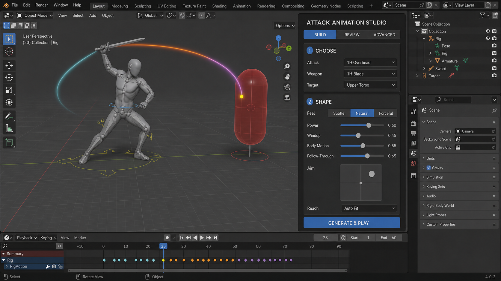
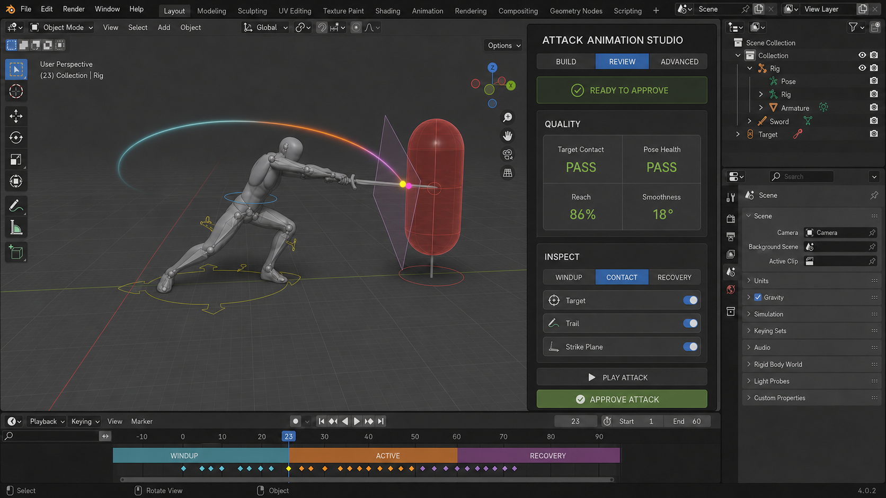
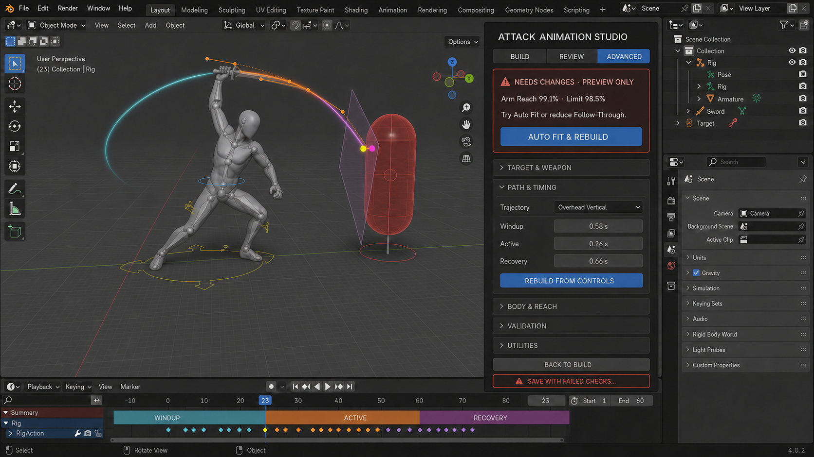

# Attack Animation Studio — UI Reorganization Concept

These three screenshots describe one coherent Blender-native workflow rather than
three competing layouts:

1. **Build** — choose the combat intent and shape the motion.
2. **Review** — inspect contact and quality, then approve.
3. **Advanced** — tune expert controls or recover from a failed check.

The visual design is intentionally compact: one goal, one dominant action, and
one clearly readable state per screen. Standard Blender toolbar, Outliner,
viewport, and timeline controls are illustrative and are not part of the Forge
button inventory below.

## 1. Build

The Build tab is the default landing state. It keeps the artist on the three
decisions that define the attack—Attack, Weapon, and Target—then exposes only
the shaping controls that are useful on almost every pass. `Reach` defaults to
`Auto Fit` so the first result is adapted to the selected character.

### Build controls

| Control | What it does | Behavior and rules |
| --- | --- | --- |
| **BUILD** | Opens the attack setup and macro-shaping view. | Selected by default. A dot or short `Changes not built` message should appear when any recipe value changes after a preview was generated. |
| **REVIEW** | Opens the generated-preview inspection and approval view. | Disabled until a preview exists. It may remain available for a failed preview because failed experiments are still reviewable. |
| **ADVANCED** | Opens expert trajectory, body, solver, validation, and utility controls. | Available after a character is prepared. Advanced edits make the current preview stale until rebuilt. |
| **Attack** | Chooses the starter Motion Master or a promoted preset. | Production list: `1H Overhead`, `1H Slash Right to Left`, `1H Slash Left to Right`, `1H Heavy Diagonal`, and `1H Thrust`. Loading a starter also loads its normal trajectory and timing. |
| **Weapon** | Chooses the held weapon proxy and contact geometry. | Production list: `1H Blunt / Mace`, `1H Blade`, and `Dagger / Short Blade`. Replaces the visible proxy immediately so a previous weapon cannot remain on the hand. `2H Generic (Architecture)` should live in Advanced until its solve is production-ready. |
| **Target** | Chooses the body region the baked weapon path must contact. | Options remain `Head`, `Upper Torso`, `Center Mass`, `Low Torso`, and `Custom`. Changing it invalidates the previous targeting proof. |
| **Subtle** | Applies restrained secondary-body motion and a comfortably bent arm. | A high-level Feel preset. It changes body-style values without changing attack identity, target, or weapon. |
| **Natural** | Applies the compact, connected production-default Feel preset. | Default selection. The highlighted segment makes the current preset obvious. Any direct expert body-style edit changes Feel to `Custom`. |
| **Forceful** | Applies stronger anticipation and body support within the same hard reach limits. | It must never relax the reach, contact, continuity, or approval gates. |
| **Power** | Adjusts strike speed and secondary wrist/torso contribution. | Maps to the existing `motion_macro_strike_power` property. Changing it marks the preview stale. |
| **Windup** | Shortens or deepens anticipation. | Maps to `motion_macro_windup`; it shapes the motion without exposing raw control points. |
| **Body Motion** | Reduces or increases torso and stance support. | Maps to `motion_macro_body_motion`; lower-body preservation rules still apply. |
| **Follow-Through** | Changes the amount of motion after contact while preserving the same target. | Maps to `motion_macro_follow_through`. Excessive values can produce an actionable reach or continuity failure. |
| **Aim** | Adjusts horizontal and vertical aim around the exact contact anchor. | One two-axis pad replaces separate `Aim Left / Right` and `Aim Down / Up` sliders. Double-click or a small reset affordance should return it to center. |
| **Reach** | Selects character-adaptive or explicit target distance. | `Auto Fit` is the default and maps to `AUTO`. Choosing `Manual` reveals a numeric Target Distance field directly below it. |
| **GENERATE & PLAY** | Builds the selected recipe, solves the body, bakes FK animation, validates it, and starts playback. | Maps to the existing permissive Generate & Preview path. It always creates and plays a preview, even when checks fail. Success routes naturally to Review; failure routes to the Advanced recovery state. It does **not** approve or save the attack. |

### Build values intentionally moved out of the main path

- Target Distance is conditional on Manual reach.
- Weapon Length and Grip to Contact move to **Advanced → Target & Weapon**.
- Arm Relaxation can be exposed under an optional `More Motion` row or folded
  into Feel; it does not need equal visual weight on every build.
- Raw target dimensions, strike-segment geometry, body-style internals, solver
  limits, and validation tolerances remain Advanced-only.

## 2. Review

Review is a decision screen, not another editing panel. It freezes the attack at
useful phases, makes the intended and actual contact evidence visible, and turns
the existing long status strings into a small set of scannable checks.

### Review controls

| Control | What it does | Behavior and rules |
| --- | --- | --- |
| **BUILD** | Returns to the simple recipe controls. | Any edit made there marks this review stale and disables approval until the attack is rebuilt. |
| **REVIEW** | Shows current preview evidence and approval actions. | Selected in this screenshot. It should display either `READY TO APPROVE`, `WARNING`, or `NEEDS CHANGES · PREVIEW ONLY`. |
| **ADVANCED** | Opens detailed editing or failure recovery. | The best next destination when a quality card is not `PASS`. |
| **WINDUP** | Jumps to the anticipation/windup inspection pose. | Pauses playback and places the playhead at the named phase pose. |
| **CONTACT** | Jumps to first intended impact and reveals review helpers. | Creates or reveals the reduced target, weapon, strike-plane, and trail review set on demand. Yellow is intended contact; magenta is the closest baked contact point. |
| **RECOVERY** | Jumps to the recovery inspection pose. | Pauses playback at the named recovery pose so silhouette and balance can be checked. |
| **Target** | Shows or hides the mathematical target volume and contact markers. | Maps to `motion_show_target`. This is a preview helper only and never exports. |
| **Trail** | Shows or hides the baked weapon trail. | Maps to `motion_show_trail`. The proposed phase colors are cyan Windup, orange Active, and violet Recovery for clear separation on the dark viewport. |
| **Strike Plane** | Shows or hides the required strike plane or thrust line. | Maps to `motion_show_plane`. It is useful for direction and plane-error review and never exports. |
| **PLAY ATTACK** | Replays the current baked preview from its beginning. | Maps to the existing Motion Studio preview operator. It does not rebuild, mutate, approve, or bypass the preview. |
| **APPROVE ATTACK** | Marks the exact current Action as reviewed and eligible for packaging/export. | Enabled only when targeting geometry is `PASS`, pose health is `PASS`, continuity is clean, and the preview proof is current. `WARN`, `FAIL`, a stale preview, or later animation edits disable it. |

### Quality cards are status, not buttons

| Status | Meaning |
| --- | --- |
| **Target Contact** | Confirms the baked weapon contact region intersects the selected target during `ACTIVE` and satisfies direction/plane rules. |
| **Pose Health** | Summarizes arm reach, elbow bend, shoulder support, torso contribution, deform translation, and solve error. |
| **Reach** | Shows the worst relevant shoulder-to-wrist extension. Clean production range remains at least 55% and below the 92% near-lock warning; 98.5% is the hard ceiling. |
| **Smoothness** | Shows maximum one-frame FK angular change. Up to 22° is clean, over 22° through 25° is a blocking warning, and over 25° fails. |

The successful Review state deliberately omits the bypass action. A dangerous
override should never sit beside playback and normal approval.

## 3. Advanced and failure recovery

Advanced is progressively disclosed. When the generated experiment fails, the
most useful diagnosis and recovery action appear above the expert sections. The
artist can still inspect and intentionally keep a rejected result, but that path
is visually separated from normal approval.

### Advanced controls

| Control | What it does | Behavior and rules |
| --- | --- | --- |
| **BUILD** | Returns to the fast authoring controls. | Preserves current recipe values; does not silently rebuild. |
| **REVIEW** | Returns to the current preview evidence. | Available for both passing and failed previews. Approval remains disabled for this shown failure. |
| **ADVANCED** | Shows expert editing, diagnostics, and recovery. | Selected in this screenshot. |
| **AUTO FIT & REBUILD** | Switches reach to Auto Fit, recalculates character-safe distance/contact, rebuilds, validates, and replays. | This proposed composite action combines the current Natural Auto Fit and rebuild/preview operations. It is the dominant recovery action when reach is the reported cause. |
| **TARGET & WEAPON** | Expands target dimensions, Manual distance, lateral/height offsets, and weapon contact geometry. | Collapsed by default. Its header may show a short summary such as `Upper Torso · 1H Blade · Auto Fit`. |
| **PATH & TIMING** | Expands trajectory family, named path controls, display controls, and phase timing. | Open in the screenshot because it is the most common expert edit area. |
| **Trajectory** | Chooses Horizontal, Diagonal Down, Overhead Vertical, Thrust, or Custom path behavior. | Changing it invalidates the previous bake and validation. |
| **Windup** | Sets the WINDUP phase duration in seconds. | Maps to `motion_windup_seconds`. |
| **Active** | Sets the ACTIVE/contact phase duration in seconds. | Maps to `motion_active_seconds`; contact must still occur inside this phase. |
| **Recovery** | Sets the RECOVERY phase duration in seconds. | Maps to `motion_recovery_seconds`. |
| **REBUILD FROM CONTROLS** | Re-solves the body from the edited expert path/timing controls, bakes, validates, and plays the new preview. | Replaces the ambiguous separation between `Rebuild Edited Controls` and later manual validation for the normal expert path. |
| **BODY & REACH** | Expands Feel internals and solver/reach controls. | Contains Anticipation, Torso Power, Stance Compression, Follow Through, Recovery, Arm Extension, Elbow Style, Wrist Style, elbow-pole values, torso support, reach thresholds, and shoulder-support cap. |
| **VALIDATION** | Expands validation evidence and tolerances. | Contains plane/line error, contact window, direction minimum, sampling step, plus `VALIDATE BAKED PATH`. Tolerance edits are expert-only and make prior validation stale. |
| **UTILITIES** | Expands infrequent maintenance and reuse actions. | Contains `RESTORE HELPERS`, `HIDE HELPERS`, `BUILD FROM MOTION MASTER`, `PROMOTE AS PRESET`, and `REPAIR HAND SOCKETS`. These actions should not compete with Build or Approve. |
| **BACK TO BUILD** | Returns to the Build tab without accepting the failure. | Keeps the failed preview available for comparison until a new build replaces it. |
| **SAVE WITH FAILED CHECKS…** | Intentionally accepts the exact reviewed failed preview for game export. | Opens a confirmation dialog listing every failed/warning check. On confirmation, maps to the current bypass-and-save behavior and writes the audit record. Editing the animation afterward invalidates the bypass. This action appears only when a current failed preview exists and must never be styled as a normal primary action. |

### Buttons inside collapsed Advanced sections

| Button | What it does |
| --- | --- |
| **NATURAL AUTO FIT** | Measures the current character and sets safe target distance and weapon contact values without approving anything. |
| **VALIDATE BAKED PATH** | Re-runs geometry and pose-health checks on the current bake; it does not change animation curves. |
| **RESTORE HELPERS** | Recreates missing preview-only target, path, plane, and expert control helpers. |
| **HIDE HELPERS** | Removes or hides Motion Studio helpers while leaving the baked Action intact. |
| **BUILD FROM MOTION MASTER** | Reloads the selected starter/promoted Motion Master and builds a fresh preview from it. |
| **PROMOTE AS PRESET** | Saves a deliberately reviewed, approved attack as a reusable target-relative Motion Master. Disabled until the Action is approved. |
| **REPAIR HAND SOCKETS** | Creates or repairs managed runtime hand-socket helpers without resetting artist-authored grip offsets. |

## Recommended interaction rules

- Keep the current sandbox contract: generation always produces a playable
  experiment; approval remains strict.
- Keep exactly one dominant action per screen: `GENERATE & PLAY`, `APPROVE
  ATTACK`, or the context-specific recovery action.
- Use `PASS`, `WARN`, `FAIL`, and `STALE` consistently. Never encode state by
  color alone; always include the word and an icon.
- Changing any recipe, path, timing, body, solver, or tolerance value makes
  Review stale immediately.
- Clicking a failed quality card should open Advanced and expand the section
  that contains the likely correction.
- Move Legacy / Procedural Drafting outside the primary Attack Studio tabs into
  a separate collapsed legacy area.
- Remove the duplicate `OFFENSIVE MOTION STUDIO` heading and rename `LET ME
  COOK` to the plain-language `SHAPE` or `MOTION` section.
- Keep helpers preview-only in `DSB_OFFENSIVE_MOTION_STUDIO`; no helper may
  export as a GLB node or bone.

## Current implementation anchors

- Panel drawing: `dreadstone_animation_forge/ui/panels.py`, function
  `_draw_offensive_animation`.
- Scene properties: `dreadstone_animation_forge/__init__.py`, beginning at the
  Weapon-first Offensive Motion Studio properties.
- Build, preview, validation, approval, bypass, and helper operators:
  `dreadstone_animation_forge/offensive_motion_studio.py`.
- Workflow law and persistence contract:
  `docs/OFFENSIVE_MOTION_STUDIO_CONTRACT.md`.

These are visual direction mockups, not literal captures of an implemented
panel. The final Blender UI should use native `UILayout` controls and the
existing Forge properties/operators wherever the mapping above already exists.
